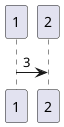

\newpage

## VII. Anexos

\anexo{a:example}{Ejemplo de elementos}

**Fórmulas matemática**

$$Y = X + C$$

> Donde: \newline
> $Y$. Dependiente \newline
> $X$. Independiente \newline
> $C$. Constante

\hfill
**Notas pie de páginas**

Ejemplo de nota [^1]. Nota en la misma línea^[Nota 2]

[^1]: Nota 1

\hfill
**Citar APA**

@doc2024 @bib2024 @pd2024 @apa2022 @lua2024

[@doc2024]

\hfill
**Figuras APA**

Referencia a la Figura \ref{f:chart}.

\hfill

\raggedright
\figura{f:chart}{Figura nueva}
\centering\includegraphics[height=5cm]{./data/images/chart.png}

_Nota_. Adaptado de los datos de @apa2022.
\justifying

\newpage
**Tablas APA**

Referencia a la Tabla \ref{t:poblacion}.

\hfill

\raggedright
\tabla{t:poblacion}{Población}
| Column 1 | Column 2 | Column 3 |
| -------- | -------- | :------: |
| row 1    | row 2    |  row 3   |
| row 4    | row 5    |  row 6   |
|          | Total    |  row 7   |

_Nota_. Adapatado de los datos de @bib2024.
\justifying

\hfill
**PlantUML**

\hfill
**Tablas de datos TSV**

\tsv{./data/tsv/table}
